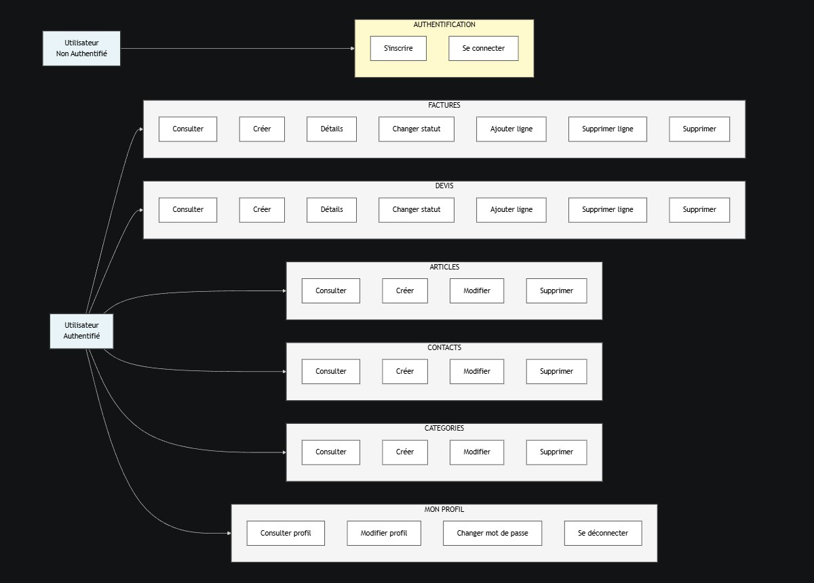
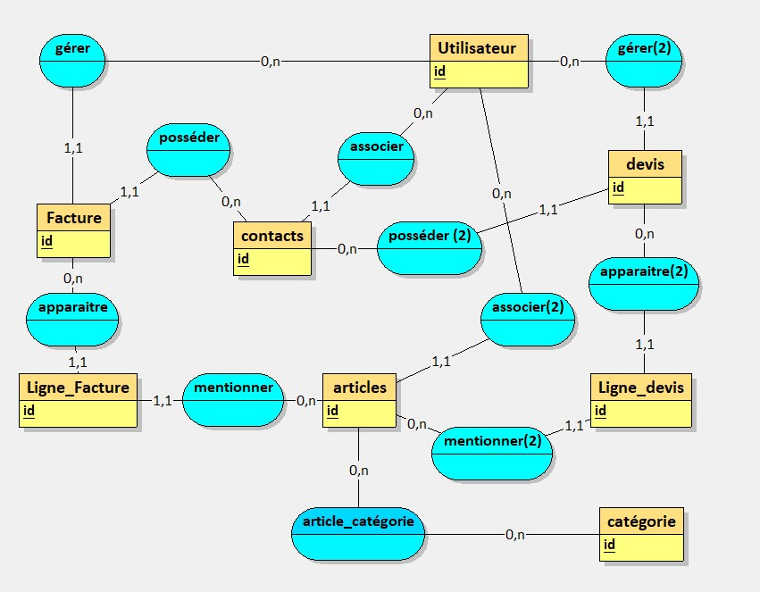

# Gestion Comptabilité Simplifiée

Une application de gestion comptable moderne et légère construite avec **Express.js** et **SQLite**.

## 🎯 Fonctionnalités

- ✅ **Authentification** - Inscription/Connexion sécurisée avec JWT
- ✅ **Articles** - Gestion du catalogue de produits/services
- ✅ **Contacts** - Gestionnaire de clients et fournisseurs
- ✅ **Factures** - Création et suivi de factures avec calcul automatique
- ✅ **Devis** - Gestion de devis avec différents états
- ✅ **Interface** - UI responsive et intuitive

## 📋 Structure du projet

```
src/
├── config/
│   ├── database.js           # Configuration SQLite
│   └── initDatabase.js       # Script d'initialisation
├── controllers/              # Logique métier
│   ├── authController.js     # Auth & sessions
│   ├── articleController.js
│   ├── contactController.js
│   ├── factureController.js
│   └── devisController.js
├── routes/                   # Définition des routes
│   ├── auth.js
│   ├── articles.js
│   ├── contacts.js
│   ├── factures.js
│   └── devis.js
├── middleware/               # Middlewares
│   └── auth.js              # Authentification JWT
├── views/                    # Templates EJS
│   ├── index.ejs            # Page d'accueil
│   ├── login.ejs
│   ├── signup.ejs
│   ├── dashboard.ejs
│   ├── articles/
│   ├── contacts/
│   ├── factures/
│   └── devis/
├── public/
│   └── css/style.css        # Styles CSS
├── app.js                    # Configuration Express
└── server.js                 # Point d'entrée

script.sql                 # Schéma base de données
```
##      Diagramme Use Case 


## 🚀 Installation et démarrage

### Option 1: Avec Docker (recommandé)

**Prérequis**
- Docker Desktop (inclut Docker + Docker Compose)

**Étapes**
```powershell
# 1. Construire l'image
docker-compose build

# 2. Lancer l'app
docker-compose up -d

# 3. Accéder à l'application
# http://localhost:3000

# 4. Vérifier le statut
docker-compose ps

# 5. Voir les logs
docker-compose logs -f app

# 6. Arrêter
docker-compose down
```

---

### Option 2: En local (développement)

**Prérequis**
- Node.js v22.20.0+
- npm 10.9.3+

**Étapes**
```bash
# 1. Installer les dépendances
npm install

# 2. Initialiser la base de données
npm run init-db

# 3. Démarrer en développement
npm run dev

# 4. Accéder à l'application
# http://localhost:3000
```

**En production**
```bash
npm start
```

## � Architecture Docker

```
📦 Conteneur Node.js (v22.20.0)
├── Port: 3000
├── Volume: ./src/data (BD SQLite persistée)
└── Variables d'env: .env
```

| Fichier | Rôle |
|---------|------|
| `docker-compose.yml` | Orchestration des services |
| `.dockerignore` | Exclusion des fichiers inutiles |

**Todos les changements de code** sont synchronisés automatiquement avec le conteneur via le volume `./:/app`.

## � Accès à la base de données

La base de données SQLite (`src/data/compta.db`) peut être consultée de plusieurs façons :

### 1. **Via l'interface web** (recommandé)
```
http://localhost:3000
```
Consulte les données directement dans l'app (Articles, Contacts, Factures, etc.)

### 2. **Avec DBeaver** (GUI gratuite)
- Télécharge [DBeaver](https://dbeaver.io/download/)
- Fichier → Nouvelle connexion → SQLite → Sélectionne `src/data/compta.db`
- Visualise tables, schémas, exécute des requêtes SQL

### 3. **VS Code Extension**
- Installe [SQLite](https://marketplace.visualstudio.com/items?itemName=alexcvzz.vscode-sqlite)
- Clic-droit sur `src/data/compta.db` → "Open Database"
- Consulte et requête depuis VS Code

### 4. **sqlite3 CLI** (terminal)
```bash
sqlite3 src/data/compta.db
.tables              # Voir les tables
.schema articles     # Voir le schéma
SELECT * FROM articles LIMIT 5;
.quit
```

> **Note** : La BD SQLite est un fichier local persisté. Lors du Docker, elle reste synchronisée via le volume `./src/data`.

## �🔐 Authentification

- **Inscription/Connexion** - Email et mot de passe hashé (bcryptjs)
- **JWT** - Token stocké en cookie httpOnly (20 min. d'expiration)
- **Sécurité** - Toutes les routes sauf `/login` et `/signup` protégées
- **Session** - Middleware d'authentification sur chaque requête

## 🧪 Tests

**Jest** - 36 tests automatisés pour la logique métier

```bash
# Lancer les tests
npm test

# Mode watch (reformatage auto)
npm run test:watch

# Voir le coverage
npm test -- --coverage
```

**Couverture** : Articles, Factures, Devis, Contacts, Catégories

## 🔧 Variables d'environnement (.env)

```
NODE_ENV=development
PORT=3000
DB_PATH=./src/data/compta.db
JWT_SECRET=your_jwt_secret_key_change_this_in_production
JWT_EXPIRE=20m
SESSION_SECRET=your_session_secret_change_this
```

## � Base de données

Base **SQLite** automatiquement créée dans `src/data/compta.db`
### Diagramme de classes



> **Note** : Par souci de lisibilité, seuls les primary key ont été précisés sur le diagramme. Pour les autres champs, référez-vous au [script.sql](script.sql) du repo.

### Schéma
- `utilisateurs` - Comptes utilisateurs
- `articles` - Catalogue de produits/services avec gestion du stock
- `contacts` - Clients et fournisseurs
- `factures` & `lignes_facture` - Factures et lignes détaillées
- `devis` & `lignes_devis` - Devis et lignes détaillées
- `categories` & `articles_categories` - Catégorisation flexible des articles

### Fonctionnalités clés
- **Restauration de stock** - Automatiquement déclenchée lors de la suppression d'une facture/devis
- **Calculs montants** - TVA (20%) et montant TTC calculés automatiquement au ajout/suppression de ligne
- **Indexation** - Colonnes essentielles indexées pour performance optimale
- **Intégrité referentielle** - Contraintes de clés étrangères avec CASCADE

## 📝 Flux de travail

1. **Créer des articles** - Avec prix HT et gestion du stock
2. **Créer des contacts** - Clients et fournisseurs
3. **Émettre facures/devis** - Lignes détaillées avec calculs auto
4. **Tracking** - États brouillon → envoyée, gestion de l'historique
5. **Stock** - Décrémentation lors de la ligne facture, restauration à la suppression

## 🛠️ Évolutions futures possibles

- ✨ Export PDF des factures/devis
- ✨ Email client automatique  
- ✨ Rapports et statistiques avancés
- ✨ Multi-devise et conversion
- ✨ Notifications temps réel

## 📄 Licence

MIT - Libre d'utilisation

## 👨‍💻 Support

Pour tout problème, consultez les logs du serveur ou envoyez un message d'erreur.

---

**Version** : 1.0.0  
**Dernière mise à jour** : 2026-03-30  
**Stack** : Express.js + SQLite + EJS
